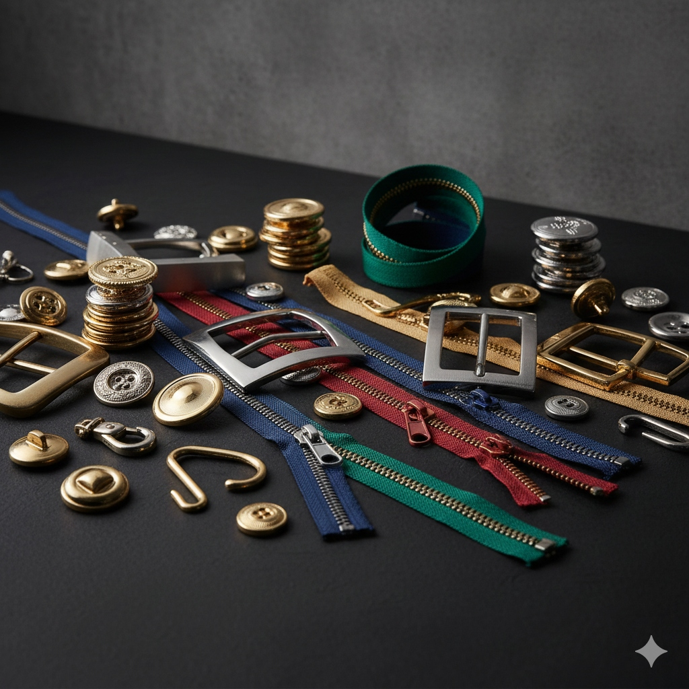

# SAIMPEX - Premium Garment Accessories



## Company Profile

**SAIMPEX** is a premier B2B exporter and manufacturer of high-quality garment accessories, established in 2023. We specialize in supplying wholesalers, exporters, and global fashion brands with an exquisite range of products designed for durability and style.

### Who We Are
*   **Established**: 2023
*   **Location**: New Delhi, India
*   **Focus**: Global B2B Export & Wholesale
*   **Experience**: 10+ Years of Excellence

### Our Stats
*   **100+** Global Brands Trust Us
*   **50+** Countries Served
*   **1M+** Units Shipped Annually
*   **2 Hour** Average Response Time

### Our Products
We offer a comprehensive catalog of premium accessories including:
*   **Buttons**: Zinc Alloy, Brass, Polyester, Natural Shell, and more.
*   **Zippers**: Metal, Nylon, and custom YKK-standard zippers.
*   **Buckles**: Fancy metal buckles for belts and bags.
*   **Hardware**: Hooks, Eyes, Ring Adjustors, Sliders, and O-Rings.


---

## Project Technology Stack

This web application is built with modern technologies to ensure a premium, responsive, and fast user experience.

*   **Framework**: [React](https://react.dev) + [Vite](https://vitejs.dev)
*   **Language**: [TypeScript](https://www.typescriptlang.org)
*   **Styling**: [Tailwind CSS](https://tailwindcss.com) + [shadcn/ui](https://ui.shadcn.com) for components
*   **Animations**: [Framer Motion](https://www.framer.com/motion) + [Lucide React](https://lucide.dev) icons
*   **Backend/Database**: [Supabase](https://supabase.com)
*   **Deployment**: [Vercel](https://vercel.com) / [Lovable](https://lovable.dev)

## Running Locally

1.  Clone the repository:
    ```sh
    git clone <YOUR_GIT_URL>
    ```
2.  Install dependencies:
    ```sh
    npm install
    ```
3.  Start the development server:
    ```sh
    npm run dev
    ```

---

